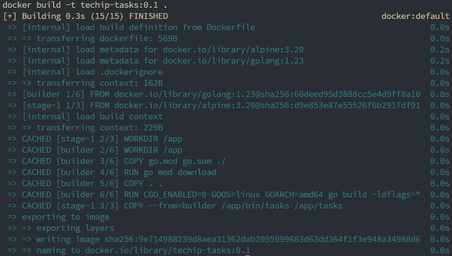
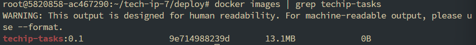
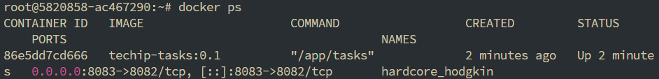
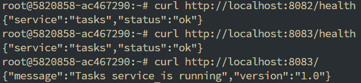
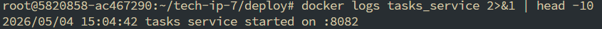
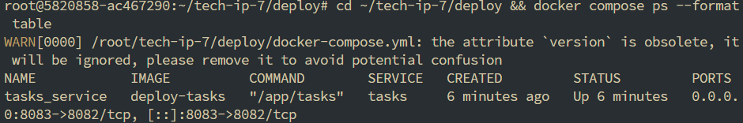
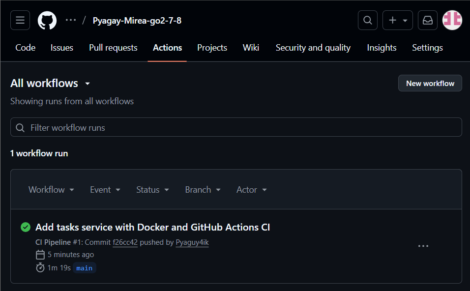
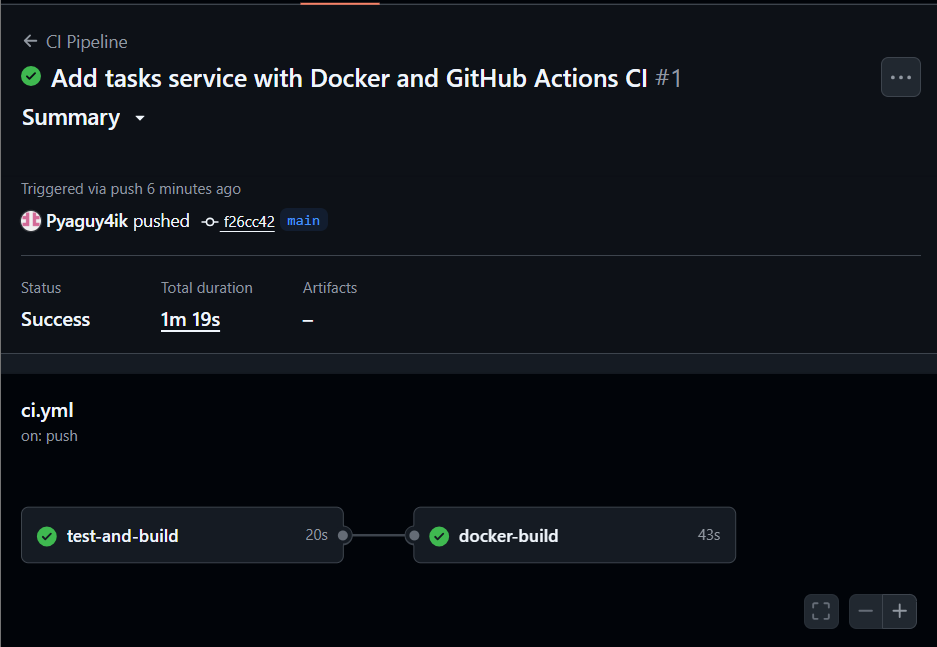
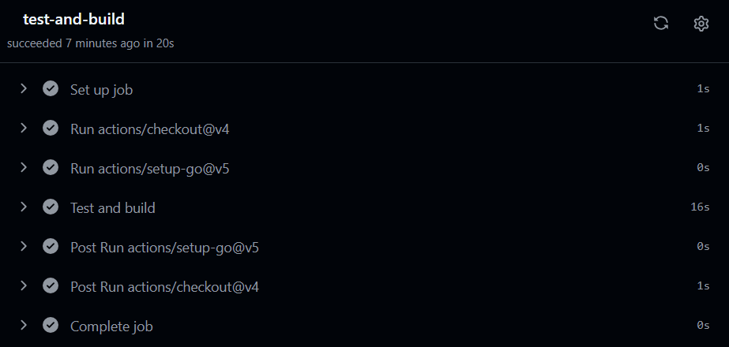

# Практические занятия №7 и №8: Docker-контейнеризация и GitHub Actions CI/CD

## Описание

В рамках данных практических работ выполнена контейнеризация Go-сервиса `tasks` с помощью Docker и настроен автоматизированный CI/CD-пайплайн с использованием GitHub Actions.

---

## Структура проекта

tech-ip-7/
├── .github/
│ └── workflows/
│ └── ci.yml # CI/CD пайплайн GitHub Actions
├── services/
│ └── tasks/
│ ├── cmd/
│ │ └── tasks/
│ │ └── main.go # HTTP-сервис на Go
│ ├── internal/
│ ├── Dockerfile # Multi-stage Dockerfile
│ ├── .dockerignore
│ ├── go.mod
│ └── go.sum
├── deploy/
│ └── docker-compose.yml # Docker Compose для локального запуска
├── .gitignore

---

## Практическая работа №7: Docker-контейнеризация

### 1. Сервис tasks

HTTP-сервис на Go с эндпоинтами:
- `GET /health` — проверка работоспособности
- `GET /` — информация о сервисе

### 2. Сборка Docker-образа



```bash
docker build -t techip-tasks:0.1 .
```

### 3. Список Docker-образов


### 4. Запуск контейнера


### 5. Проверка работоспособности


### 6. Логи контейнера


### 7. Запуск через Docker Compose


## Практическая работа №8: GitHub Actions CI/CD

### 1. Пайплайн CI в GitHub Actions


### 2. Успешное выполнение пайплайна


### 3. Лог выполнения test-and-build


### 4. Лог выполнения docker-build


### 5. Файл ci.yml

```bash
name: CI Pipeline

on:
  push:
    branches: [ "main", "master" ]
  pull_request:
    branches: [ "main", "master" ]

jobs:
  test-and-build:
    runs-on: ubuntu-latest
    steps:
      - uses: actions/checkout@v4
      - uses: actions/setup-go@v5
        with:
          go-version: '1.23'
      - name: Test and build
        run: |
          cd services/tasks
          go mod tidy
          go test ./...
          go build ./cmd/tasks

  docker-build:
    runs-on: ubuntu-latest
    needs: test-and-build
    steps:
      - uses: actions/checkout@v4
      - name: Build Docker image
        run: |
          cd services/tasks
          docker build -t techip-tasks:${{ github.sha }} .
```
